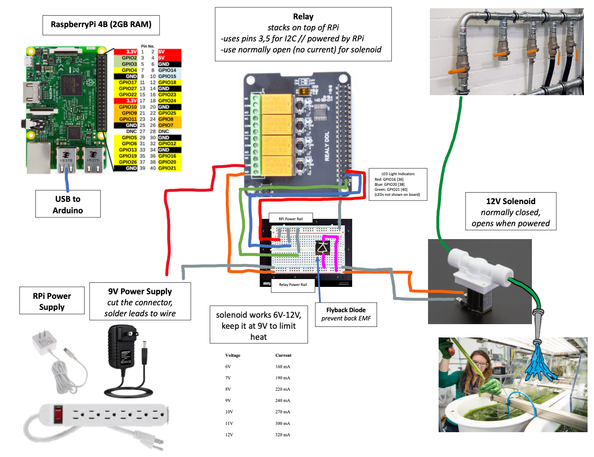

# PondAutomation
A collaboration for the development of an automated algae pond. This github repository serves as both the knowledge base of the system as well as the code backend. 

Each github 'branch' represents a different phase of the project. You can select which 'Phase' of the project you would like to view the code for in the dropdown above. 

### File Structure
`PondAutomation/`
|`configs/` contains configurations needed to run the system  
| `data/` upon running the script, outputs are stored here  
| |---- `DATETIME/`  
| | |---- `pond_settings_used.csv` contains the configurations used  
| | |---- `DATETIME_sensor_data` contains sensor measurements (future work)  
| `functions/` contains the scripts that run on the raspberry pi for operation  
| `graphics/` contains diagrams and photos, some of which are used in this guide  
| `automate_pond.py` is the single script that needs to be run by the user, it controls the entire process  

### System Requirements
The following describes the platform the code runs on, other configurations have not been tested
- RaspberryPi 4B
- python3

Python Libraries
- standard libraries
- RPi.GPIO library, which should come pre-installed on standard Raspbian OS systems

### Accessing the Code
If you are new to git and plan to use its features, you should see this [beginner guide](https://medium.com/@PhilParisi/getting-started-with-github-for-people-who-hate-github-1f25b071930d) (amongst others). 

If you plan to edit code and contribute to this project, you should clone the repository with  
`git clone https://github.com/PhilParisi/PondAutomation`.

If you simply want a local copy of the code to play around with, you can either clone (like above) or click the green `Code` button and `Download ZIP` to your local system.

# Phase I - Drain n' Fill Prototype
Goal: develop the simplest form of an automated drain and fill system. 

In this case, we aren't fully draining the tank. We are simply allowing new water to enter the system and overflow into the overflow bin. 

## Schematic
The below schematic shows the wiring of electrical components and application.

#### Key Hardware
1. RaspberryPi 4B (2GB RAM) for control
2. Relay to power solenoid
3. Solenoid (6-12V) to open/shutoff flow
4. Breadboard w/ Diode and LED state indicator lights (see 'State Transition Diagram' below)

## Operation and Failure Modes

### Light Indicators
There are three lights in the box that are used to communicate to people what's happening:
- Green --> 'drought' state. No water flows as solenoid is shut. Everything is ok.
- Blue --> 'flood' state. Water is flowing as solenoid is open. Everything is ok.
- Red --> 'error' state. You shouldn't be in this state. Something is wrong and it's probably not evident. Try SSH'ing into the RPi, use tmux to get into the terminal, look at and note the recent messages, kill it (ctrl+c) and restart with `python3 automate_pond.py`. If that doesn't work, contact the programmer. 

### Failure
The solenoid is **normally closed**, which means:
  - If you need to stop the flow, simply unplug everything (power it down) and the solenoid will close, stopping flow.
  - If there is 'no flow' and you want flow, power on the system and run the scripts. If nothing is working, contact the programmer or remove the solenoid manually to ensure flow.

### Inputs
When running the script, the user is prompted for key settings that determine behavior of the system
1. How many MINUTES until the first flood? --> the system starts with no flow, then will start flowing after this duration
2. What is the FLOOD duration in MINUTES? --> how long the solenoid will stay open (free flow) for during floods
3. What is the DROUGHT duration in MINUTES? --> how long the solenoid will stay closed (no flow) for during droughts
4. How many MINUTES do you want to run the program for? --> if a number is inputted, program ends when this duration is reached // if 0 is inputted, there will be no programmed end to the program

### Outputs
- the solenoid is programmed to open and close at intervals set in the 'Inputs' section
- data is written to .csv files in the 

## State Transition Diagram
Below is the state transition diagram which describes the behavior of the system, and how the program transitions to different states. This is also called the 'control flow'.  

## Working with your RaspberryPi

### Setting up your RaspberryPi (first time)
In this section, we cover the basics of setting up a raspberryPi device. For this, you will need the physical computer with a monitor, keyboard, and mouse.

1. insert the microSD card into the slot on the underside of the panel
2. plug in peripherals (monitor, keyboard, mouse), no power yet
3. power on the RPi (important that the monitor is plugged in before powering on)
4. follow instructions to setup the device like you would a normal computer (treat RPi like a normal computer fyi, and remember the username/password that you set!)
5. set the hostname of your device by opening a terminal (CTRL + ALT + T), typing `sudo raspi-config`, go to 'system options', go to 'hostname' and type the hostname you want. close the terminal
6. enable ssh (secure shell connectivity), by opening a terminal (CTRL + ALT + T), typing `sudo raspi-config`, etner, go to 'interface options', go to 'SSH' and switch to 'yes'. close the terminal
7. reboot the system by opening a terminal and typing `sudo reboot 0`, enter
8. log back into your RPi
9. connect to the internet (either by ethernet cable, or via WiFi)
10. clone this repository to your home direction by opening a terminal (CTRL + ALT + T) and typing `cd`, enter, `git clone https://github.com/PhilParisi/PondAutomation`, enter
11. different versions of the code are available on different _branches_, type `git fetch --all` to get all branches locally
12. switch to the branch you want with `git checkout branch_you_want`
13. if your RPi is all setup, you should be good to go! see the 'Running Scripts' section of this guide

### Remote Connections to your RaspberryPi
If you want to run scripts like you are using a regular computer with a monitor, keyboard, and mouse directly attached to the RPi, skip to 'Running Scripts'.  
If your RPi is stashed somewhere and you want to connect remotely, keep reading.  

We can connect to the pi over WiFi or via an SSH cable. WiFi is recommended and tends to more reliable corporate computer systems.

#### WiFi
1. connect the pi to a wifi network (you should have already done this in 'Setting up your RPi'), connect your personal computer to the same network
2. MAC and Linux --> open a terminal and `ssh username@hostname` or `ssh username@ip_address` and you should be in!
3. Windows --> I recommend downloading 'Bitvise SSH' program (google it), launch it, then type in the details into the GUI, and you should be in!

#### Ethernet
1. connect an ethernet cable between your pi and your personal computer (this forms a direct connection)
2. make sure your computer and RPi are disconnected from other networks

## Running Scripts
Assuming you have the code on the pi and everything is physically setup according to the schematic...
1. Connect to the RPi (SSH in from either terminal (Mac/Linux) or Bitvise (Windows))
4. Once you ssh in, you already in a terminal for the RPi.
5. Navigate into the project folder that contains this code, likely `cd PondAutomation`
6. Launch the automation file with `python3 automate_pond.py`
7. Answers any questions the script asks you
8. Program should run!
9. Use CTRL+C to kill the program

## Useful Commands for the RPi

### Terminal Commands
These are commands you can run from the command line right after SSH'ing into the RPi
- `ls` will _list_ the contents of the current folder you are in
- `cd folder_name` will _change directory_ into the folder with the name 'folder_name' (note, it has to be visible when you run `ls`)
  - ex: `cd PondAutomation`
- `cd ..` moves you 'up' one directory (gets out of the current directory)
- `python3 script_name.py` uses python to run a python script
  - ex: `python3 automate_pond.py` or `python3 test_lights.py`
- `ssh username@ip_address` will ssh another device

### Tmux Commands
tmux is a terminal management system. It allows us to 'detach' from a terminal. Once we SSH into the RPi, we want the ability to launch a script _and detach_ from the terminal so we can break the SSH connection, go about our day, and let the script continue to run.
- `tmux` or `tmux new-session -s session_name` will start a new tmux session. If the pond is not running, you need to start a new session, then run the automate_pond.py script
- `tmux list-sessions` shows the current sessions. If the pond is currently running, this will show you the current session name
- `tmux attach-session -t session_name` will attach your terminal to the existing tmux session. Do this when the pond is running and you want to attach to it
- `tmux kill-session -t session_name` will destroy a tmux session. Do this when you accidentally made a tmux session and need to get rid of it. You can always start a new one :)
